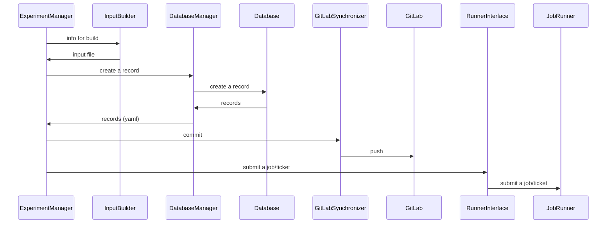
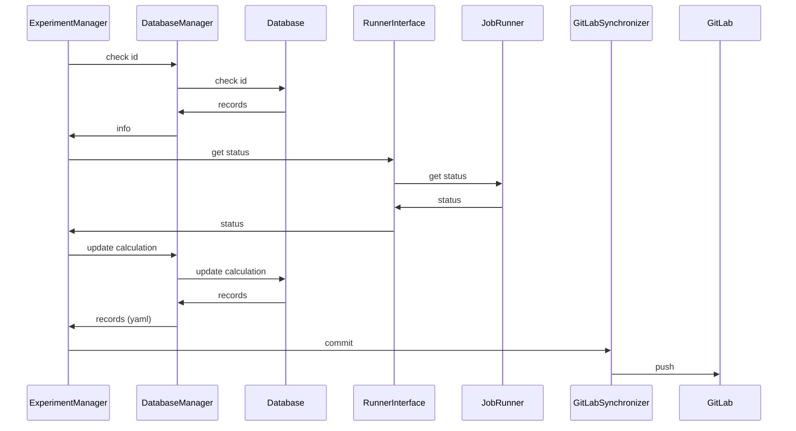

# 開発用諸図

## Sequence Diagram

Phase1~2までの実装ではこの図の通りに動作する

### 作業の実行

```mermaid
sequenceDiagram
    participant EM as ExperimentManager
    participant IB as InputBuilder
    participant DM as DatabaseManager
    participant DB as Database
    participant GLS as GitLabSynchronizer
    participant GL as GitLab
    participant RI as RunnerInterface
    participant JR as JobRunner
    EM ->> IB: info for build
    IB ->> EM: input file
    EM ->> DM: create a record
    DM ->> DB: create a record
    DB ->> DM: records
    DM ->> EM: records (yaml)
    EM ->> GLS: commit
    GLS ->> GL: push
    EM ->> RI: submit a job/ticket
    RI ->> JR: submit a job/ticket
```

### 作業状況の確認 / 作業終了時

```mermaid
sequenceDiagram
    participant EM as ExperimentManager
    participant DM as DatabaseManager
    participant DB as Database
    participant RI as RunnerInterface
    participant JR as JobRunner
    participant GLS as GitLabSynchronizer
    participant GL as GitLab
    EM ->> DM: check id
    DM ->> DB: check id
    DB ->> DM: records
    DM ->> EM: info
    EM ->> RI: get status
    RI ->> JR: get status
    JR ->> RI: status
    RI ->> EM: status
    EM ->> DM: update calculation
    DM ->> DB: update calculation
    DB ->> DM: records
    DM ->> EM: records (yaml)
    EM ->> GLS: commit
    GLS ->> GL: push
```
