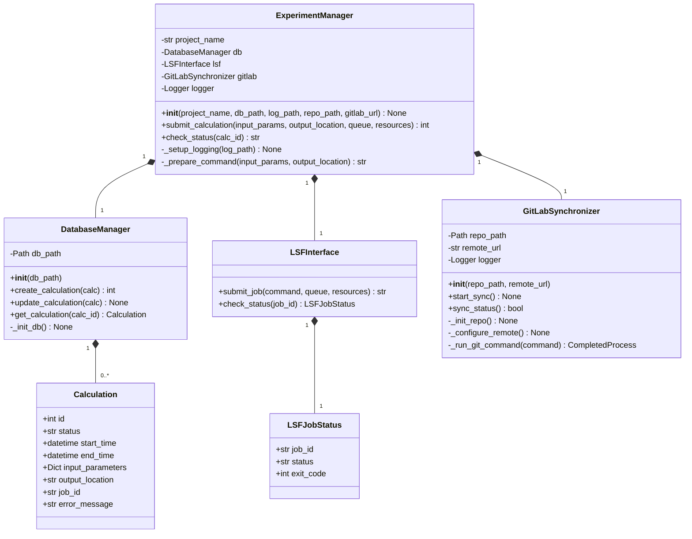
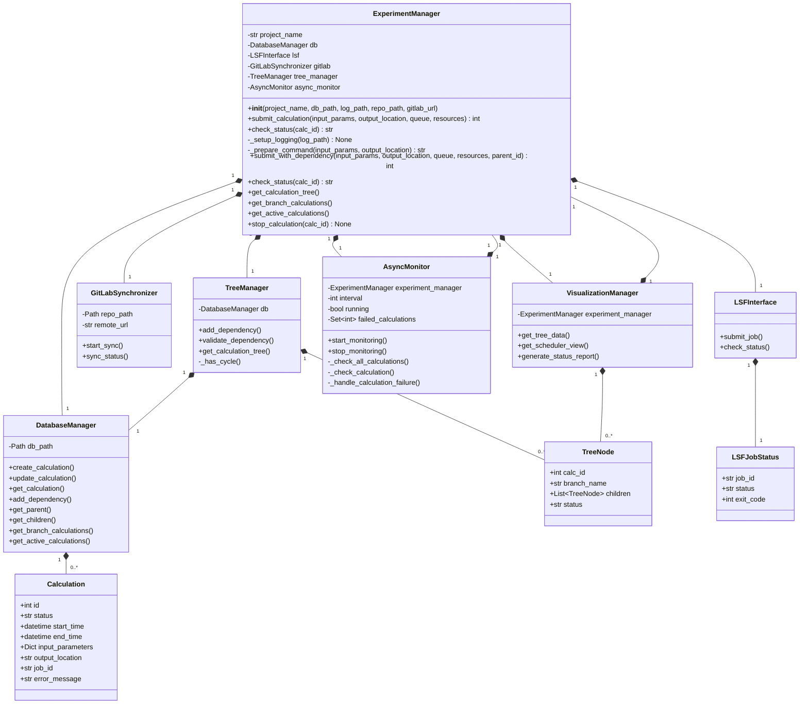
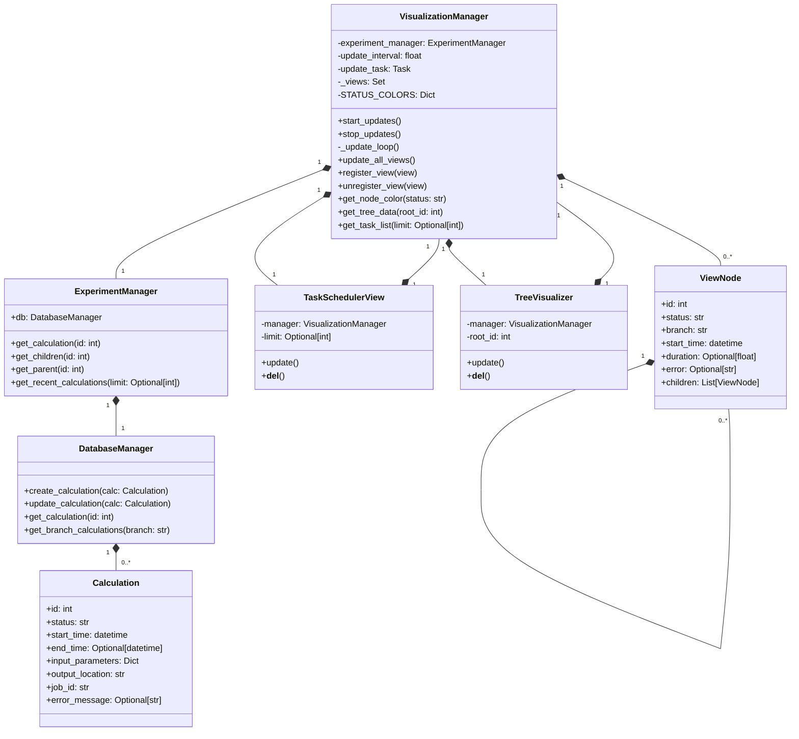

# 開発用諸図

## Class Diagram

### Phase 1

Phase1 は基本的な計算の実行と管理を行うクラスを定義します。

```mermaid
classDiagram
    class ExperimentManager {
        -str project_name
        -DatabaseManager db
        -LSFInterface lsf
        -GitLabSynchronizer gitlab
        -Logger logger
        +__init__(project_name, db_path, log_path, repo_path, gitlab_url) None
        +submit_calculation(input_params, output_location, queue, resources) int
        +check_status(calc_id) str
        -_setup_logging(log_path) None
        -_prepare_command(input_params, output_location) str
    }

    class DatabaseManager {
        -Path db_path
        +__init__(db_path)
        +create_calculation(calc) int
        +update_calculation(calc) None
        +get_calculation(calc_id) Calculation
        -_init_db() None
    }

    class LSFInterface {
        +submit_job(command, queue, resources) str
        +check_status(job_id) LSFJobStatus
    }

    class GitLabSynchronizer {
        -Path repo_path
        -str remote_url
        -Logger logger
        +__init__(repo_path, remote_url)
        +start_sync() None
        +sync_status() bool
        -_init_repo() None
        -_configure_remote() None
        -_run_git_command(command) CompletedProcess
    }

    class Calculation {
        +int id
        +str status
        +datetime start_time
        +datetime end_time
        +Dict input_parameters
        +str output_location
        +str job_id
        +str error_message
    }

    class LSFJobStatus {
        +str job_id
        +str status
        +int exit_code
    }

    ExperimentManager "1" *-- "1" DatabaseManager
    ExperimentManager "1" *-- "1" LSFInterface
    ExperimentManager "1" *-- "1" GitLabSynchronizer
    DatabaseManager "1" *-- "0..*" Calculation
    LSFInterface "1" *-- "1" LSFJobStatus
```

### Phase 2

Phase2 は Phase1 のクラスを拡張して、計算の依存関係を管理する機能を追加します。

```mermaid
classDiagram
    class ExperimentManager {
        -str project_name
        -DatabaseManager db
        -LSFInterface lsf
        -GitLabSynchronizer gitlab
        -TreeManager tree_manager
        -AsyncMonitor async_monitor
        +__init__(project_name, db_path, log_path, repo_path, gitlab_url)
        +submit_calculation(input_params, output_location, queue, resources) int
        +check_status(calc_id) str
        -_setup_logging(log_path) None
        -_prepare_command(input_params, output_location) str
        +submit_with_dependency(input_params, output_location, queue, resources, parent_id) int
        +check_status(calc_id) str
        +get_calculation_tree()
        +get_branch_calculations()
        +get_active_calculations()
        +stop_calculation(calc_id) None
    }

    class DatabaseManager {
        -Path db_path
        +create_calculation()
        +update_calculation()
        +get_calculation()
        +add_dependency()
        +get_parent()
        +get_children()
        +get_branch_calculations()
        +get_active_calculations()
    }

    class LSFInterface {
        +submit_job()
        +check_status()
    }

    class GitLabSynchronizer {
        -Path repo_path
        -str remote_url
        +start_sync()
        +sync_status()
    }

    class TreeManager {
        -DatabaseManager db
        +add_dependency()
        +validate_dependency()
        +get_calculation_tree()
        -_has_cycle()
    }

    class AsyncMonitor {
        -ExperimentManager experiment_manager
        -int interval
        -bool running
        -Set~int~ failed_calculations
        +start_monitoring()
        +stop_monitoring()
        -_check_all_calculations()
        -_check_calculation()
        -_handle_calculation_failure()
    }

    class VisualizationManager {
        -ExperimentManager experiment_manager
        +get_tree_data()
        +get_scheduler_view()
        +generate_status_report()
    }

    class Calculation {
        +int id
        +str status
        +datetime start_time
        +datetime end_time
        +Dict input_parameters
        +str output_location
        +str job_id
        +str error_message
    }

    class TreeNode {
        +int calc_id
        +str branch_name
        +List~TreeNode~ children
        +str status
    }

    class LSFJobStatus {
        +str job_id
        +str status
        +int exit_code
    }

    ExperimentManager "1" *-- "1" DatabaseManager
    ExperimentManager "1" *-- "1" LSFInterface
    ExperimentManager "1" *-- "1" GitLabSynchronizer
    ExperimentManager "1" *-- "1" TreeManager
    ExperimentManager "1" *-- "1" AsyncMonitor
    ExperimentManager "1" *-- "1" VisualizationManager

    DatabaseManager "1" *-- "0..*" Calculation
    TreeManager "1" *-- "1" DatabaseManager
    TreeManager "1" *-- "0..*" TreeNode
    LSFInterface "1" *-- "1" LSFJobStatus
    AsyncMonitor "1" *-- "1" ExperimentManager
    VisualizationManager "1" *-- "1" ExperimentManager
    VisualizationManager "1" *-- "0..*" TreeNode
```

### Phase 3

```mermaid
classDiagram
    class VisualizationManager {
        -experiment_manager: ExperimentManager
        -update_interval: float
        -update_task: Task
        -_views: Set
        -STATUS_COLORS: Dict
        +start_updates()
        +stop_updates()
        -_update_loop()
        +update_all_views()
        +register_view(view)
        +unregister_view(view)
        +get_node_color(status: str)
        +get_tree_data(root_id: int)
        +get_task_list(limit: Optional[int])
    }

    class ViewNode {
        +id: int
        +status: str
        +branch: str
        +start_time: datetime
        +duration: Optional[float]
        +error: Optional[str]
        +children: List[ViewNode]
    }

    class TaskSchedulerView {
        -manager: VisualizationManager
        -limit: Optional[int]
        +update()
        +__del__()
    }

    class TreeVisualizer {
        -manager: VisualizationManager
        -root_id: int
        +update()
        +__del__()
    }

    class ExperimentManager {
        +db: DatabaseManager
        +get_calculation(id: int)
        +get_children(id: int)
        +get_parent(id: int)
        +get_recent_calculations(limit: Optional[int])
    }

    class DatabaseManager {
        +create_calculation(calc: Calculation)
        +update_calculation(calc: Calculation)
        +get_calculation(id: int)
        +get_branch_calculations(branch: str)
    }

    class Calculation {
        +id: int
        +status: str
        +start_time: datetime
        +end_time: Optional[datetime]
        +input_parameters: Dict
        +output_location: str
        +job_id: str
        +error_message: Optional[str]
    }

    VisualizationManager "1" *-- "1" ExperimentManager
    VisualizationManager "1" *-- "0..*" ViewNode
    VisualizationManager "1" *-- "1" TaskSchedulerView
    VisualizationManager "1" *-- "1" TreeVisualizer
    ExperimentManager "1" *-- "1" DatabaseManager
    DatabaseManager "1" *-- "0..*" Calculation
    TaskSchedulerView "1" *-- "1" VisualizationManager
    TreeVisualizer "1" *-- "1" VisualizationManager
    ViewNode "1" *-- "0..*" ViewNode
```
