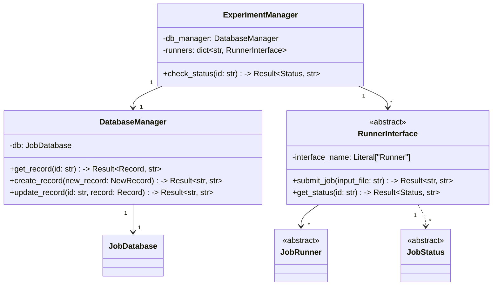
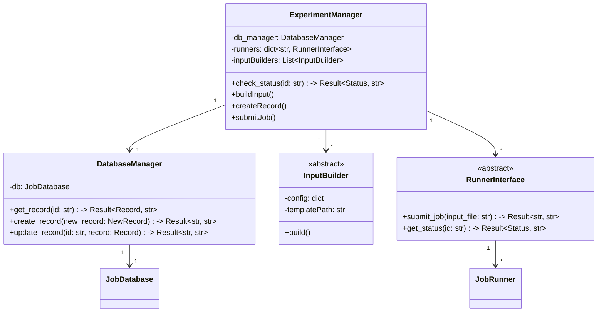
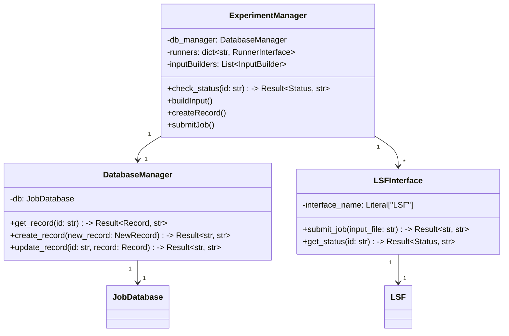
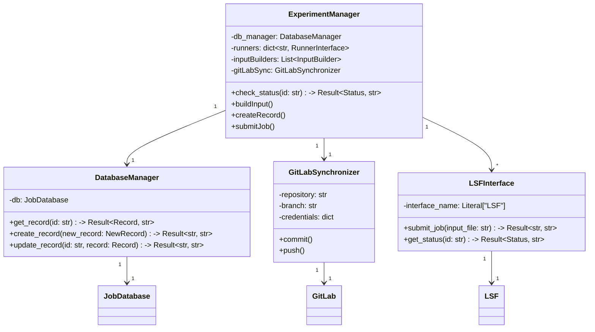
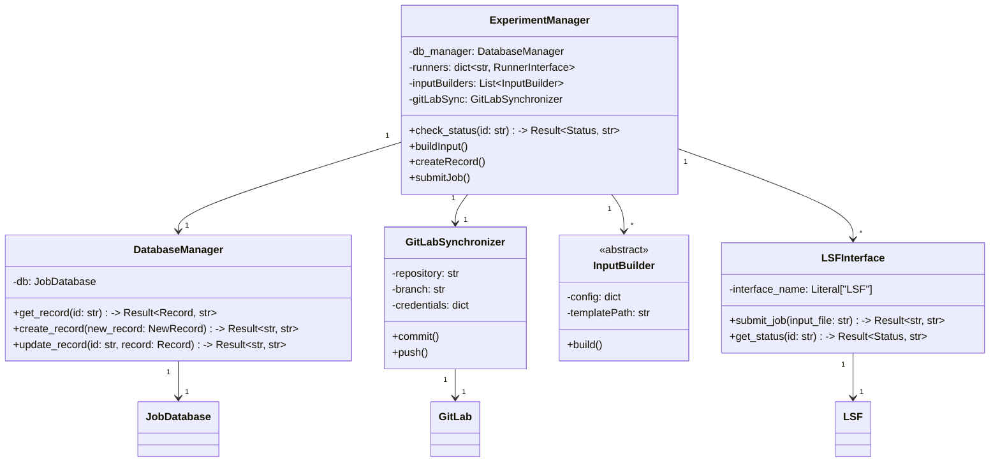

# クラス図 （開発中）

実装していく間に増えるかもしれないので、覚えていたらここに追加していく。

## 要件

1. Python >=3.11 の予定。
2. LSFが使える環境で、`bjobs` および `bsub` コマンドがCLIで使える。Pythonならsubprocessで呼び出せる。バージョンは現状不明。
3. GitLabが使える環境で、GitLab APIが使える。Pythonなら `requests` モジュールで呼び出せる。詳細はこれからやる。
4. データベースはPythonの `sqlite3` モジュールで管理する。データベース設計はこれからやる。

## Phase 1-(a)

まずはRunnerInterfaceを作る。

## Phase 1-(b)

RunnerInterfaceとの連携を中心に、ExperimentManagerを拡張する。

## Phase 1-(c)

LSFとの連携を中心に、ExperimentManagerを拡張する。

## Phase 1-(d)

GitLabとの連携を中心に、ExperimentManagerを拡張する。

## Phase 1-(e)

InputBuilderとの連携を中心に、ExperimentManagerを拡張する。

このクラス図では、シーケンス図に示された主要なコンポーネント間の関係を表現しています。各クラスには、シーケンス図で示された主要な操作をメソッドとして含めています。また、クラス間の依存関係も矢印で示しています。

主な特徴：

- `ExperimentManager`は中心的なクラスとして、他のコンポーネントを統括します
- 各コンポーネントは単一責任の原則に従い、明確な役割を持っています
- 外部システム（DatabaseとGitLab）との連携は、それぞれ専用のマネージャークラスを通じて行われます
