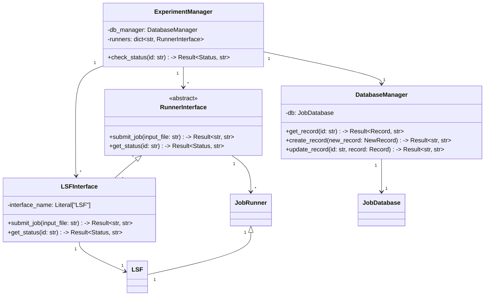
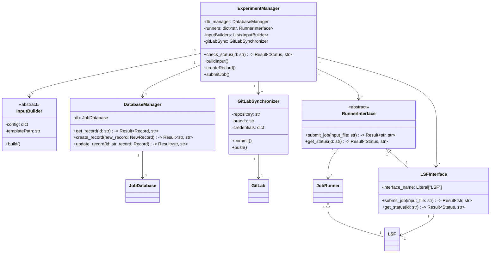

# クラス図

実装していく間に増えるかもしれないので、覚えていたらここに追加していく。

## Phase 1-(a)

まずはLSFにおける `bjobs` コマンドをパースするツールを作る。

## Phase 1-(b)

LSFとの連携を中心に、ExperimentManagerを拡張する。

このクラス図では、シーケンス図に示された主要なコンポーネント間の関係を表現しています。各クラスには、シーケンス図で示された主要な操作をメソッドとして含めています。また、クラス間の依存関係も矢印で示しています。

主な特徴：

- `ExperimentManager`は中心的なクラスとして、他のコンポーネントを統括します
- 各コンポーネントは単一責任の原則に従い、明確な役割を持っています
- 外部システム（DatabaseとGitLab）との連携は、それぞれ専用のマネージャークラスを通じて行われます
